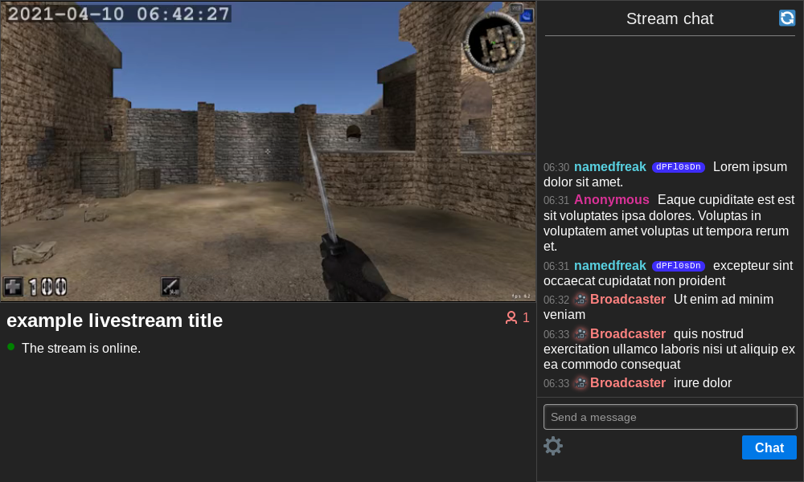

# onion-livestreaming

Recipe for livestreaming over the Tor network



This was originally made for fun over the course of five days and hence sloppiness may pervade (especially in the CSS).

## Dependencies
* Tor
* FFmpeg
* [Flask](https://github.com/pallets/flask)
* [captcha](https://github.com/lepture/captcha)
* [Flask-HTTPAuth](https://github.com/miguelgrinberg/Flask-HTTPAuth) (to identify the broadcaster in chat)
* [Flask-Compress](https://github.com/colour-science/flask-compress) (should probably be optional)
* Knowledge of FFmpeg and Tor

## Features
* Twitch-looking web interface (mobile friendly)
* Change stream title as you're streaming
* Viewer count
* Stream on/off indicator (and with JavaScript, playback error messages with prompts to refresh)
* Chat with custom names & tripcodes
* Ban chatters / hide messages
* Flood detection / liberal captcha
* Works without JavaScript

## Issues
* CSS is spaghetti (e.g. the PureCSS framework is used sometimes when it might not need be)
* Fonts are hard-coded and you might not have them
* AFAIK the FFmpeg command in `stream.sh` only works on Linux, change it for other OSs
* Slow: stream delay of at least 40 seconds. Hopefully this will decrease when congestion control gets into Tor: https://youtu.be/watch?v=zQDbfHSjbnI
* Most of the code is in `app.py`; it should be split into several files with more narrow purposes.

## How it works

* FFmpeg creates an HLS stream,
* Flask creates a website interface for the stream,
* tor makes the website accessible at an onion address

## Explanation of the FFmpeg command in `stream.sh`

TODO

See https://www.martin-riedl.de/2018/08/24/using-ffmpeg-as-a-hls-streaming-server-part-1/ and https://www.martin-riedl.de/2018/08/24/using-ffmpeg-as-a-hls-streaming-server-part-2/ as `stream.sh` is based on those.

## Tutorial

To run this yourself, get this source code. As the project currently exists you might need to change some things:

* If you're on Windows `stream.sh` will be wrong for you and so will all the fonts in `app.py`.
* If you're on macOS `stream.sh` might need to be changed a bit and you might not have the fonts in `app.py`.
* If you're on Linux `stream.sh` will probably be alright but you might not have all the fonts in `app.py`.

Lots of the stuff in `app.py` and `stream.sh` should at some point be moved into a configuration file that you can edit more easily.

Assuming you've dealt with that, this is what you have to do.

### FFmpeg

Go to the project root and type `sh stream.sh`. This starts the livestream.

### Flask

Go to the project root and type `flask run`. This starts the websever.

### tor

Now your webserver is running on port 5000 (or whichever port you set it to, if you did that). We need to tell tor to create a hidden service and to point it at port 5000.

In your [torrc](https://support.torproject.org/tbb/tbb-editing-torrc/), add these two lines
```
HiddenServiceDir $PROJECT_ROOT/hidden_service
HiddenServicePort 80 127.0.0.1:5000
```
where `$PROJECT_ROOT` is the root folder of this project. When you reload tor it will create the `hidden_service` directory and your website will be online. Your onion address is in `hidden_service/hostname`.
